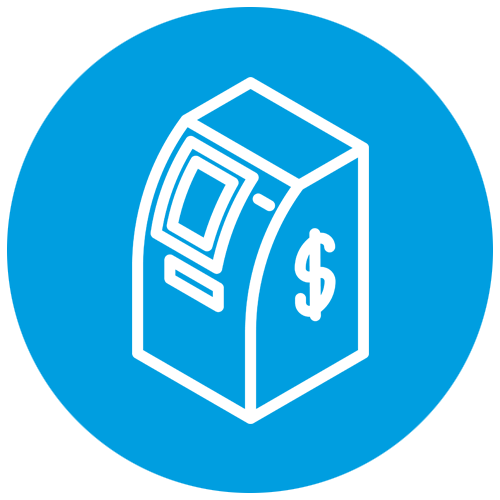

# __Projeto Caixa Eletrônico AC2__

# Teoria

O projeto consiste na criação de um Script que tem a finalidade de simular funcionalidades básicas de um caixa eletrônico bancário, como:
- Consultar Saldo
- Realizar Depósito
- Realizar Saques
- Realizar Transferências
- Encerrar as Operações  

# Java

A linguagem de programação utilizada para este projeto foi Java. Java é uma linguagem orientada a objetos desenvolvida na década de 90 por uma equipe de programadores chefiada por James Gosling, na empresa Sun Microsystems. Em 2008, Java foi adquirido pela empresa Oracle Corporation.  
<a href="https://docs.oracle.com/javase/7/docs/api/">Documentação do Java</a>

Autor:   
Matheus Avilla Vial